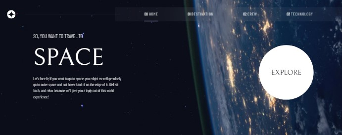

# Frontend Mentor - Space tourism website solution

## Table of contents

- [Overview](#overview)
  - [Screenshot](#screenshot)
  - [Links](#links)
- [My process](#my-process)
  - [Built with](#built-with)
  - [What I learned](#what-i-learned)
- [Author](#author)

## Overview

### Screenshot



### Links

- Live Site URL: [Space tourism app](https://space-tourism-app.web.app)

## My process

### Built with

- SCSS
- Flexbox
- CSS Grid
- laptop-first workflow
- [React](https://reactjs.org/) - JS library
- [React Redux]

### What I learned

I understood how to make a good slideshow, how to make use of react redux to manage app-wide state and also how to use react router to navigate between pages.

```react redux
import { configureStore } from "@reduxjs/toolkit";

import destinationReducer from "./destination-slice";

import crewReducer from "./crewSlice";

import techReducer from "./techSlice";

const Store = configureStore({
  reducer: {
    destination: destinationReducer,
    crew: crewReducer,
    tech: techReducer,
  },
});

export default Store;
```

## Author

- Frontend Mentor - [@@ejim11](https://www.frontendmentor.io/profile/@ejim11)
- Twitter - [@favourejim56](https://www.twitter.com/@favourejim56)
